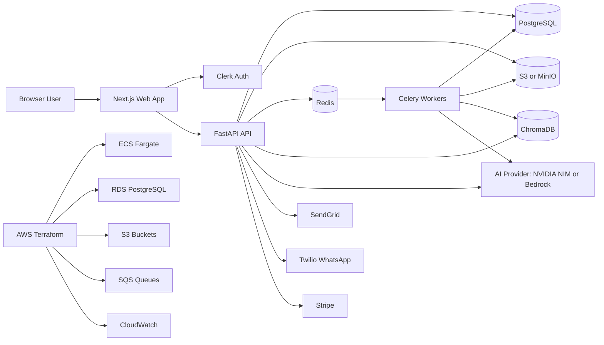
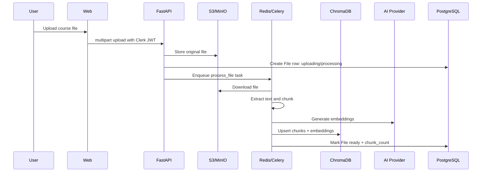

# StudyForge Architecture Blueprint

## 1. Product Vision

StudyForge is an AI-powered education platform for students, teachers, and schools. The core idea is simple: users upload course material, the system indexes it, and then turns that material into citation-backed chat answers, exams, flashcards, learning paths, slides, analytics, and collaborative study rooms.

The product is built as a product-oriented monorepo with separately deployable frontend, backend, worker, and infrastructure layers.

## 2. Primary User Roles

| Role | Main Goals |
|---|---|
| Student | Upload or access course files, chat with materials, study flashcards, take exams, follow learning paths, join study rooms. |
| Teacher | Create groups, upload resources, generate exams/slides/flashcards, assign exams, inspect student analytics. |
| School admin | Manage school-level users, groups, subscriptions, and reporting. |
| Super admin | Operate platform-wide administration and support workflows. |

## 3. Main Use Cases

### Student use cases

- Sign up/sign in through Clerk.
- Join or create a study group.
- Upload PDFs, DOCX, PPTX, and other course files.
- Wait for asynchronous file processing and indexing.
- Ask questions against uploaded course material with citations.
- Review pinned chat answers.
- Generate or study flashcards with spaced repetition.
- Take assigned exams and view results.
- Continue incomplete learning path modules.
- Join collaborative rooms with shared group context.

### Teacher use cases

- Create class/group spaces.
- Invite members into a group.
- Upload official class materials.
- Generate quizzes or exams from selected files.
- Assign exams with start/end dates and attempt limits.
- Generate slide decks and download PPTX output.
- Monitor reading events, attempts, scores, and group analytics.
- Trigger notifications for important events.

### Platform use cases

- Sync users from Clerk webhooks.
- Enforce plan-based limits and feature gates.
- Process files in background workers.
- Store original assets in object storage.
- Store embeddings and chunks in vector search.
- Send in-app/email/WhatsApp notifications.
- Deploy repeatably to dev, staging, and production AWS environments.

## 4. Current Technology Stack

| Layer | Implemented Technology |
|---|---|
| Frontend | Next.js App Router, React 18, TypeScript, Tailwind CSS |
| Frontend state/data | TanStack Query, Zustand, Axios |
| Auth frontend | Clerk Next.js middleware and provider |
| Backend API | Python FastAPI |
| Backend persistence | SQLAlchemy 2 async, Alembic migrations |
| Primary database | PostgreSQL 16 |
| Background jobs | Celery |
| Queue/broker | Redis locally; Terraform also provisions SQS for AWS-oriented task execution |
| Vector database | ChromaDB |
| Object storage | Amazon S3 primary; MinIO/R2-compatible local fallback |
| AI providers | NVIDIA NIM via OpenAI-compatible client; AWS Bedrock alternative |
| Notifications | In-app DB notifications, SendGrid email, Twilio WhatsApp |
| Billing/plan hooks | Stripe-related config and subscription model present |
| Infrastructure | Docker Compose locally; Terraform for AWS |
| AWS target | ECS Fargate for API, RDS, S3, SQS, EventBridge, IAM, Secrets Manager/SSM, CloudWatch |

Note: the README still mentions Next.js 14, but `apps/web/package.json` currently uses `next` `^15.3.0`.

## 5. Repository Structure

```text
studyforge/
  apps/
    web/                  # Next.js frontend application
    api/                  # FastAPI backend, workers, services, migrations
  packages/
    shared-types/         # Shared TypeScript contracts
  infra/
    terraform/            # AWS modules and env overlays
  docs/                   # Product, architecture, ops, and quality documents
  docker-compose.yml      # Local full-stack runtime
```

## 6. High-Level System Diagram



## 7. Frontend Architecture

### Routing

The web app uses the Next.js App Router under `apps/web/app`.

Important route groups:

| Route area | Purpose |
|---|---|
| `/` | Landing page; redirects signed-in users to dashboard. |
| `/sign-in`, `/sign-up` | Clerk auth screens. |
| `/onboarding` | First group creation and initial upload flow. |
| `/dashboard` | Main authenticated home. |
| `/groups` | Group listing and group creation. |
| `/groups/[groupId]` | Group workspace and files. |
| `/groups/[groupId]/chat` | RAG chat with uploaded materials. |
| `/groups/[groupId]/exams` | Exam generation and exam list. |
| `/groups/[groupId]/flashcards` | Flashcard set generation and study. |
| `/groups/[groupId]/learning-paths` | AI-generated learning paths and module reading. |
| `/groups/[groupId]/slides` | Slide deck generation and viewing. |
| `/groups/[groupId]/teacher` | Teacher analytics. |
| `/groups/[groupId]/rooms` | Group study rooms. |
| `/rooms/[roomId]` | Room detail experience. |
| `/analytics` and `/analytics/[groupId]` | Analytics overview and group analytics. |

### Client providers

The root layout wraps the app with:

- `ClerkProvider` for auth context.
- `QueryProvider` for TanStack Query caching.
- `AuthSync` for registering Clerk token retrieval into the shared Axios client.
- `UpgradeModal` for plan/limit upsell flows.
- `react-hot-toast` for notifications.

### API client pattern

`apps/web/lib/api.ts` centralizes backend access:

- Base URL from `NEXT_PUBLIC_API_URL`.
- Axios request interceptor attaches `Authorization: Bearer <Clerk token>`.
- Response interceptor handles:
  - `401`: redirect to sign-in.
  - `402` or selected `429`: open upgrade modal.
  - `500`: show generic error toast.
- Typed helper functions: `apiGet`, `apiPost`, `apiPut`, `apiPatch`, `apiDelete`.

### Frontend feature hooks

Feature data access is organized through hooks:

- `use-groups.ts`
- `use-files.ts`
- `use-chat.ts`
- `use-streaming-chat.ts`
- `use-exams.ts`
- `use-flashcards.ts`
- `use-learning-paths.ts`
- `use-slides.ts`
- `use-rooms.ts`
- `use-teacher.ts`
- `use-continue-learning.ts`

This keeps UI components focused on presentation while hooks own query keys, mutations, cache invalidation, and backend endpoints.

## 8. Backend Architecture

### FastAPI entrypoint

`apps/api/app/main.py` creates the FastAPI app, configures logging, CORS, request IDs, readiness checks, and mounts API v1 routers under `/api/v1`.

Mounted domains:

- Auth
- Groups
- Files
- Chat
- Exams
- Flashcards
- Rooms
- Analytics
- Teacher
- Admin
- Notifications
- Learning paths
- Me/continue-learning
- Slides

### Backend layers

| Layer | Path | Responsibility |
|---|---|---|
| API routers | `apps/api/app/api/v1` | HTTP endpoints, auth dependencies, request/response orchestration. |
| Services | `apps/api/app/services` | Domain logic, AI calls, RAG, storage, vector search, exam/flashcard/path/slide generation. |
| Jobs | `apps/api/app/jobs` | Async job implementation called by workers. |
| Tasks | `apps/api/app/tasks` | Celery task registration and queue routing. |
| Models | `apps/api/app/models` | SQLAlchemy ORM tables. |
| Core | `apps/api/app/core` | Config, DB session, security, middleware, rate limits. |
| Migrations | `apps/api/alembic` | Database schema migrations. |
| Tests | `apps/api/tests` | Service and integration-oriented backend tests. |

### Core backend concerns

- `config.py`: environment-driven settings for DB, Redis, AI provider, S3, Clerk, SendGrid, Twilio, Stripe, SQS, EventBridge.
- `database.py`: async SQLAlchemy engine and session lifecycle.
- `security.py`: Clerk JWT verification through JWKS, local user auto-provisioning, role dependencies.
- `middleware.py`: request ID and process-time headers.
- `rate_limiter.py`: plan limits and feature flags for free/personal/school plans.

## 9. API Surface

Representative endpoint groups:

| Domain | Main endpoints |
|---|---|
| Auth | `POST /api/v1/auth/webhook` |
| Groups | `GET/POST /api/v1/groups`, group detail/delete, member invite/join flows |
| Files | list, upload, status, delete, download URL under `/api/v1/groups/{group_id}/files` |
| Chat | send message, history, pin/unpin, pinned messages under group chat routes |
| Exams | generate, list, detail, assign, start session, autosave, submit, session result |
| Flashcards | generate set, list sets, set detail, due cards, record review, delete |
| Learning paths | generate, list, detail, module detail, progress, delete |
| Slides | create deck, list decks, deck detail, progress, quiz answers, PPTX download, delete |
| Rooms | create, list by group, join by invite code, delete |
| Analytics | reading events and teacher group analytics |
| Notifications | list, mark one read, mark all read |
| Me | continue-learning feed |
| Admin | schools |

## 10. Data Model

### Core entities

| Entity | Purpose |
|---|---|
| `User` | Local user profile mapped to Clerk ID, role, plan, school, WhatsApp number. |
| `School` | School tenant/admin metadata. |
| `Group` | Class/course/study workspace. |
| `GroupMember` | User membership and role inside a group. |
| `File` | Uploaded source file metadata, storage key, processing status, chunk count. |
| `ChatMessage` | User/assistant messages with citations and pinning. |
| `Exam` | Generated or assigned exam metadata and configuration. |
| `Question` | Exam question with options, answer, explanation, source passage. |
| `ExamSession` | User exam attempt, answers, score, timing. |
| `FlashcardSet` | Generated flashcard collection. |
| `Flashcard` | Front/back card content with source passage. |
| `FlashcardProgress` | Spaced repetition state per user/card. |
| `StudyRoom` | Collaborative room with invite code. |
| `RoomMember` | Room presence/membership state. |
| `Notification` | In-app notification item. |
| `Announcement` | Group announcement with notification channels. |
| `Subscription` | User/school plan and Stripe subscription metadata. |
| `ReadingEvent` | Reading analytics from frontend tracking. |
| `LearningPath` | AI-generated path over selected files. |
| `LearningPathModule` | Ordered module content, objectives, concepts, source pages. |
| `LearningPathProgress` | User completion state per module. |
| `SlideDeck` | Generated deck metadata and PPTX URL. |
| `Slide` | Individual generated slide content, notes, quiz data, source pages. |
| `SlideProgress` | User deck progress. |
| `SlideQuizAnswer` | User answer to embedded slide quiz. |

## 11. AI and RAG Architecture

### File ingestion flow



### Chat/RAG flow

1. User sends a group-scoped question.
2. Backend verifies group membership.
3. Query is embedded through configured AI provider.
4. ChromaDB returns semantically similar chunks.
5. Reranker improves source ordering.
6. LLM generates answer grounded in retrieved chunks.
7. Backend stores user and assistant `ChatMessage` rows.
8. Frontend renders answer with citations and optional suggestions.

### Content generation flows

| Feature | Source | Generation pattern |
|---|---|---|
| Exams | Selected or all ready file chunks | Sample chunks, prompt LLM for structured questions, persist exam/questions. |
| Flashcards | Selected or all ready file chunks | Generate structured front/back cards, persist set/cards, track SM-2-like review progress. |
| Learning paths | Selected chunks | Generate outline, retrieve module-specific chunks, generate module markdown, persist module progress. |
| Slides | Selected chunks | Cluster chunks, generate deck/slide structure, enrich slides, render PPTX, upload output. |

## 12. Background Processing

Celery is configured in `apps/api/app/tasks/celery_app.py`.

| Queue | Tasks |
|---|---|
| `files` | File extraction, chunking, embeddings, vector indexing. |
| `slides` | Long-running slide generation and PPTX rendering. |
| `notifications` | Exam deadline checks and outbound notification dispatch. |

Celery Beat schedules `check-exam-deadlines` hourly.

The codebase also contains Lambda handler entrypoints and settings for `TASK_EXECUTION_MODE` plus SQS URLs, which indicates an intended evolution from local Redis/Celery to AWS-native async execution for selected workloads.

## 13. Storage Architecture

### PostgreSQL

Stores relational product state:

- Users, schools, groups, memberships.
- File metadata and processing state.
- Chat messages and citations.
- Exams, questions, sessions.
- Flashcards and progress.
- Learning paths and module progress.
- Slides and deck progress.
- Notifications, subscriptions, analytics.

### S3 or MinIO

Stores binary/object assets:

- Uploaded source files.
- Generated PPTX decks.
- Potential future images, exports, reports, and derived assets.

The storage service supports:

- AWS-managed credentials for production.
- Local endpoint/static credentials for MinIO/R2-compatible development.
- Optional server-side encryption.
- Presigned download URLs.

### ChromaDB

Stores vector collections by group. Each chunk is associated with metadata such as file ID, file name, page, and chunk index so generated answers can cite source material.

### Redis

Used locally as:

- Celery broker.
- Celery result backend.
- Optional usage/rate limit counter backend.

## 14. Authentication and Authorization

### Authentication

- Frontend routes are protected by Clerk middleware.
- Clerk session tokens are attached to API calls.
- Backend validates tokens using Clerk JWKS.
- Missing local users are auto-provisioned from Clerk Management API when possible.
- Clerk webhooks also exist for user lifecycle sync.

### Authorization

Authorization is mostly group/member based:

- Users must be group members to access group files, chat, rooms, exams, slides, learning paths, and analytics.
- Group role values include `owner`, `teacher`, and `student`.
- Global user roles include `student`, `teacher`, `school_admin`, and `super_admin`.

### Plan gating

Plans:

- `free`
- `personal`
- `school`

Examples of gated features:

- Collaborative rooms.
- Flashcards.
- PPTX generation.
- Teacher dashboard.
- WhatsApp notifications.
- Reading analytics.

Examples of limits:

- Daily chat count.
- Monthly QCM/exam generation.
- Group count.
- Files per group.

## 15. Deployment Architecture

### Local development

`docker-compose.yml` starts:

- PostgreSQL
- Redis
- MinIO
- ChromaDB server
- FastAPI API
- Celery worker
- Celery Beat
- Next.js web

### AWS infrastructure

Terraform currently provisions baseline infrastructure for `dev`, `staging`, and `prod`:

- VPC, public/private subnets, route tables, internet gateway, NAT gateway.
- Security groups.
- RDS PostgreSQL.
- S3 buckets.
- SQS queues and DLQs.
- EventBridge schedules.
- IAM roles and policies.
- Secrets Manager and SSM parameters.
- CloudWatch log groups and alarms.
- ECS Fargate API service.

Recommended production runtime shape:

```text
CloudFront or ALB
  -> Next.js web hosting
  -> FastAPI on ECS Fargate
       -> RDS PostgreSQL
       -> S3
       -> ChromaDB-compatible vector service
       -> Redis or SQS workers
       -> NVIDIA NIM or Bedrock
```

## 16. Observability and Operations

Current foundations:

- JSON-formatted API logs with environment metadata.
- Request IDs and process-time headers.
- `/health` and `/health/ready` endpoints.
- CloudWatch log group and alarm Terraform modules.
- AWS ops runbook in `docs/aws-ops-runbook.md`.
- DLQ-oriented queue design in Terraform.

Recommended additions:

- Structured request correlation in all worker logs.
- Metrics for file processing time, embedding failures, LLM latency, token cost, queue depth, and Chroma query latency.
- Sentry enabled with environment-specific DSNs.
- Synthetic smoke tests for auth, upload, chat, and worker processing.
- Admin dashboard for stuck files, failed decks, and DLQ messages.

## 17. Security Blueprint

Current strengths:

- Clerk JWT verification on backend.
- Frontend protected route middleware.
- CORS controlled by environment.
- S3 production path supports IAM role credentials.
- Terraform includes IAM roles and Secrets Manager/SSM.
- Request IDs help trace issues.

Important hardening work:

- Remove default test Clerk keys and `SECRET_KEY` fallback from production config.
- Enforce upload size/type scanning consistently.
- Add virus/malware scanning for uploads before processing.
- Add object-level access checks before presigned downloads.
- Encrypt all production buckets and RDS storage.
- Keep private subnets for database and worker dependencies.
- Add audit logs for group membership, exam assignment, deletion, and admin actions.
- Add per-route throttling for AI and upload endpoints.

## 18. Quality and Testing

Existing backend tests cover:

- AI service.
- AI provider selection.
- File processor.
- RAG service.
- Slide service.
- Continue-learning.

Recommended test map:

| Area | Tests to add |
|---|---|
| Frontend | Component tests for key group/chat/exam flows. |
| API contracts | Route-level tests for auth, permissions, and error states. |
| Workers | Integration tests for file upload to ready/error states. |
| RAG | Golden test fixtures for citations and source grounding. |
| Billing/limits | Tests for free/personal/school gates. |
| Infra | Terraform fmt/validate and plan checks in CI. |

## 19. Suggested Architecture Improvements

1. Add a root workspace manifest and task runner for unified `dev`, `test`, `lint`, and `typecheck`.
2. Make `packages/shared-types` the authoritative API contract source or replace it with generated OpenAPI TypeScript clients.
3. Add a formal `schemas/` response layer for every FastAPI route to reduce frontend/backend drift.
4. Decide whether production workers are Celery/Redis, ECS workers, Lambda/SQS, or a hybrid, then document one primary path.
5. Add OpenAPI client generation for the frontend.
6. Add a dedicated vector service deployment plan for production ChromaDB or managed vector DB alternative.
7. Add idempotency keys for long-running AI generation endpoints.
8. Add status polling or server-sent events for long-running generation workflows.
9. Add cost tracking by user/group for AI calls, embeddings, storage, and generated artifacts.
10. Add admin/support tooling for retrying failed file, slide, and notification jobs.

## 20. Build Blueprint Summary

StudyForge should be treated as four cooperating systems:

1. **Learning workspace frontend**: Next.js authenticated app with group-centered UX.
2. **Domain API**: FastAPI service owning auth validation, permissions, product workflows, and persistence.
3. **AI processing plane**: workers plus AI/vector/storage services for heavy RAG and generation workloads.
4. **Cloud platform layer**: AWS infrastructure for durable storage, secure networking, queues, secrets, logs, and scalable compute.

The most important architectural principle is that groups are the main product boundary. Most data, authorization, vector collections, files, chat, exams, slides, learning paths, rooms, and analytics are scoped to a group. Users and schools sit above that boundary; files, chunks, and generated learning artifacts sit below it.

